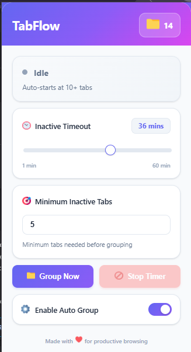

# TabFlow - Smart Tab Management Extension

Automatically organize your browser tabs by grouping inactive ones, keeping your workspace clean and organized.




---

## 🎯 Overview

**TabFlow** is a Chrome extension that automatically identifies and groups inactive tabs into a collapsible **"Inactive Tabs"** group.  
It helps reduce tab clutter and improve browser performance by organizing tabs you're not actively using.

### Key Features

#### ✨ Automatic Tab Management

- Auto-starts when you have **10+ ungrouped tabs**
- Auto-stops when you drop below **5 ungrouped tabs**
- Runs in the background without manual intervention

#### 🎯 Smart Tab Detection

- Tracks tab activity in real-time
- Only groups truly inactive tabs (configurable timeout)
- Excludes pinned tabs and tabs playing audio
- Never counts tabs already in groups

#### ⚡ Intelligent Ungrouping

- 5-second delay before ungrouping to prevent accidental removals
- Tabs automatically ungroup when you activate them
- Keeps "Inactive Tabs" group collapsed and organized

#### 🎨 User-Friendly Interface

- Clean, modern popup UI
- Real-time status updates
- One-click manual grouping
- Configurable settings with auto-save

---

## 🚀 Installation

### From Source

1. Clone or download this repository
   ```bash
   git clone https://github.com/Hybk/Tabflow0.1.git
   ```
